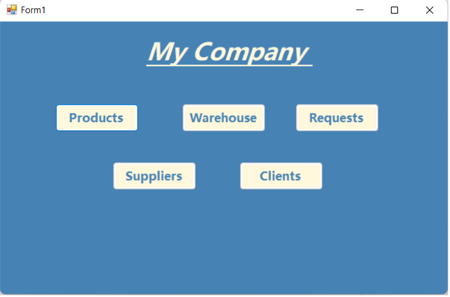
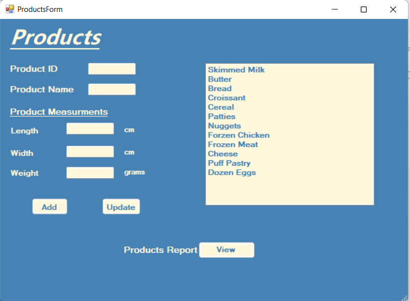
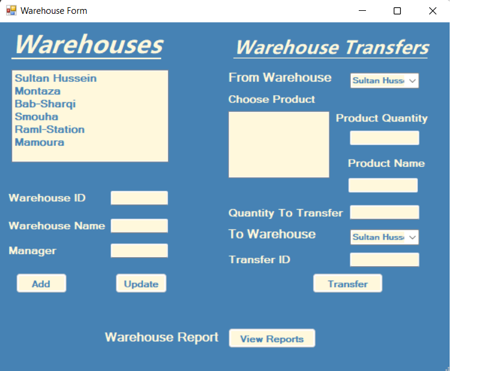
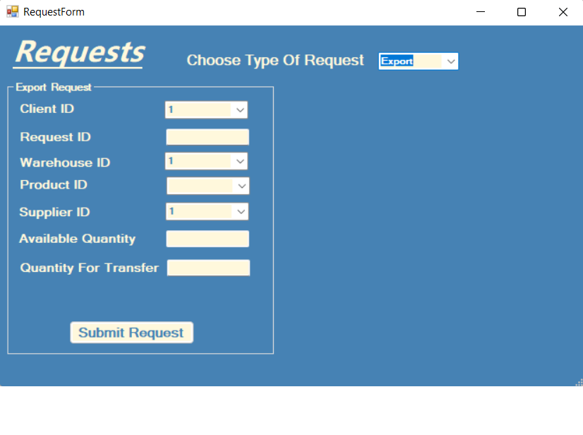
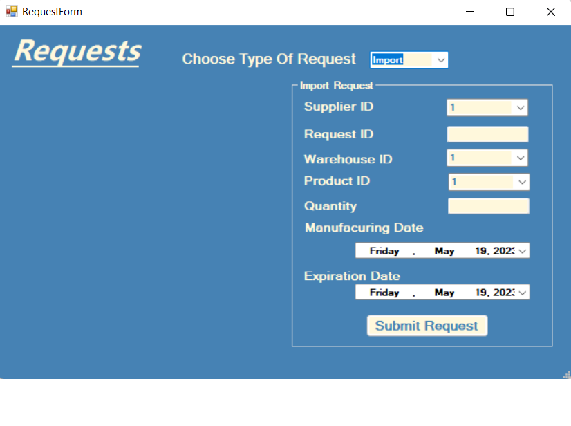
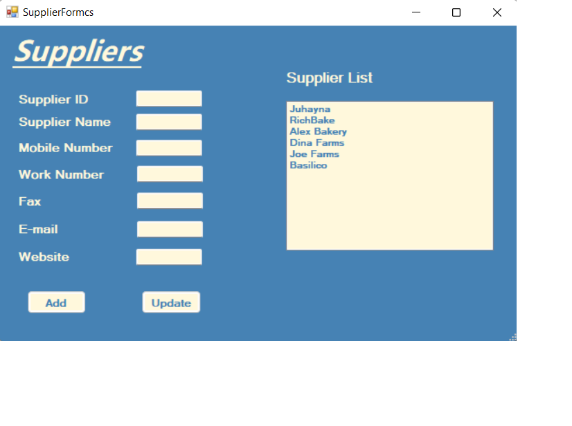
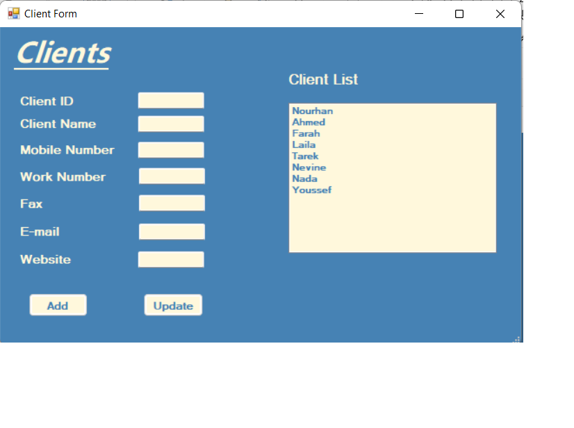

# Warehouse Management Application

Allows users to perform CRUD operations on entities such as Warehouse, Clients, Requests, Products, and alter the exisitng relationships between each and every instance of entities.

